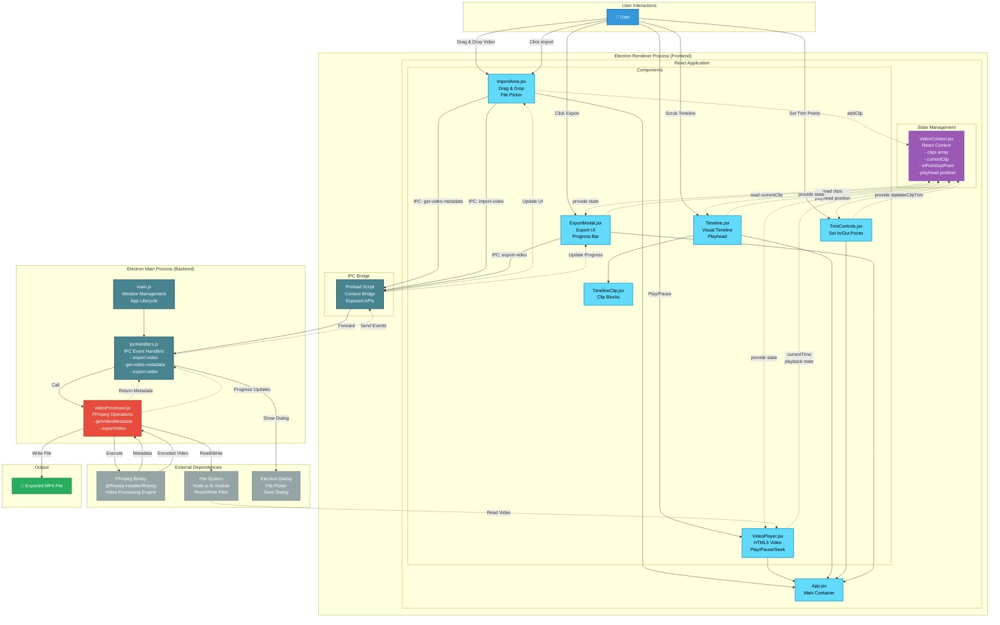
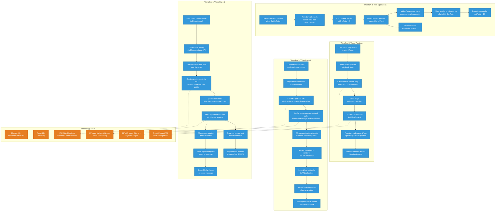

# ClipForge Architecture Documentation

## Overview

This document provides a comprehensive view of the ClipForge MVP architecture, including component relationships, data flow, and technology stack.

---

## System Architecture Diagram

This diagram shows the complete system architecture, including:
- **Electron Main Process**: Backend logic, FFmpeg processing, file system operations
- **Electron Renderer Process**: React frontend, UI components, user interactions
- **IPC Communication**: Bridge between main and renderer processes
- **External Dependencies**: FFmpeg binary, file system, Electron APIs

### Architecture Components



### Component Responsibilities

#### Renderer Process (Frontend)
- **App.jsx**: Main container, layout coordination
- **ImportArea.jsx**: File import via drag-and-drop or file picker
- **VideoPlayer.jsx**: HTML5 video playback with controls
- **Timeline.jsx**: Visual timeline with playhead
- **TimelineClip.jsx**: Individual clip blocks on timeline
- **TrimControls.jsx**: UI for setting in/out points
- **ExportModal.jsx**: Export interface with progress tracking
- **VideoContext.jsx**: Centralized state management for all components

#### Main Process (Backend)
- **main.js**: Electron app initialization, window management
- **ipcHandlers.js**: IPC event handling between main and renderer
- **videoProcessor.js**: FFmpeg wrapper for metadata extraction and export

#### External Dependencies
- **FFmpeg**: Video encoding, decoding, metadata extraction
- **File System**: Reading video files, writing exports
- **Electron Dialog**: Native file picker and save dialogs

---

## Data Flow & Workflows

This diagram illustrates the step-by-step data flow for the four core operations: Import, Playback, Trim, and Export.

### Workflow Diagram



### Workflow Details

#### 1. Video Import (A1-A9)
User imports a video file, which triggers metadata extraction via FFmpeg in the main process. The metadata is returned to the renderer and stored in VideoContext, causing all components to re-render with the new clip data.

#### 2. Video Playback (B1-B7)
User initiates playback, which controls the HTML5 video element. Time updates are captured and stored in VideoContext, allowing the timeline to synchronize its playhead position with the video.

#### 3. Trim Operations (C1-C8)
User sets trim points by scrubbing to specific times and clicking Set In/Out Point buttons. These values are stored in VideoContext, and the VideoPlayer respects these boundaries during playback.

#### 4. Video Export (D1-D11)
User triggers export, which sends the clip data and trim points to the main process. FFmpeg encodes the video with the specified trim parameters, sending progress updates back to the renderer for display.

---

## Technology Stack

### Core Technologies
- **Electron 28+**: Cross-platform desktop framework providing Node.js APIs and Chromium rendering
- **React 18+**: Component-based UI library with hooks for state management
- **FFmpeg**: Industry-standard video processing engine for encoding, decoding, and metadata extraction
- **fluent-ffmpeg**: Node.js wrapper for FFmpeg with promise-based API

### Supporting Libraries
- **webpack**: Module bundler for development and production builds
- **Babel**: JavaScript transpiler for JSX support
- **electron-builder**: Packaging tool for creating distributable executables

### Communication Patterns
- **IPC (Inter-Process Communication)**: Electron's mechanism for main/renderer process communication
- **React Context API**: Centralized state management without external dependencies
- **HTML5 Video Element**: Native browser API for video playback

---

## File Structure

```
clipforge/
├── electron/
│   ├── main.js              # Electron entry point, window management
│   ├── ipcHandlers.js       # IPC event handlers
│   └── videoProcessor.js    # FFmpeg wrapper functions
├── src/
│   ├── App.jsx              # Main React container
│   ├── index.jsx            # React entry point
│   ├── index.html           # HTML template
│   ├── components/
│   │   ├── ImportArea.jsx   # File import component
│   │   ├── VideoPlayer.jsx  # Video playback component
│   │   ├── Timeline.jsx     # Timeline visualization
│   │   ├── TimelineClip.jsx # Individual clip blocks
│   │   ├── TrimControls.jsx # Trim point controls
│   │   └── ExportModal.jsx  # Export interface
│   ├── context/
│   │   └── VideoContext.jsx # Global state management
│   └── styles/
│       ├── App.css
│       ├── ImportArea.css
│       ├── VideoPlayer.css
│       ├── Timeline.css
│       ├── TimelineClip.css
│       ├── TrimControls.css
│       └── ExportModal.css
├── build/
│   └── icon.png             # Application icon
├── package.json             # Dependencies and scripts
├── webpack.config.js        # Build configuration
├── electron-builder.yml     # Packaging configuration
└── README.md                # Setup instructions
```

---

## Key Design Decisions

### 1. Electron Architecture
**Decision**: Separate main and renderer processes with IPC communication  
**Rationale**: 
- Security: Isolates Node.js APIs from web content
- Performance: CPU-intensive FFmpeg operations run in main process
- Native access: File system and FFmpeg require Node.js

### 2. State Management
**Decision**: React Context API instead of Redux/MobX  
**Rationale**:
- Simplicity: Fewer dependencies and less boilerplate
- Performance: Sufficient for MVP scope (single video at a time)
- Development speed: Faster implementation within 72-hour deadline

### 3. Video Processing
**Decision**: FFmpeg via fluent-ffmpeg  
**Rationale**:
- Industry standard: Reliable, well-tested video processing
- Codec support: Handles MP4, MOV, WebM out of the box
- Performance: Fast encoding with `-c copy` for trim operations

### 4. Timeline Implementation
**Decision**: DOM-based with CSS positioning  
**Rationale**:
- Time constraint: Faster than Canvas-based implementation
- MVP sufficient: Handles single clip editing effectively
- Accessibility: Better keyboard and screen reader support

---

## Development Phases

### Phase 1: Foundation (PR #1)
- Project setup with Electron + React
- Webpack configuration
- Basic window and app structure

### Phase 2: Import (PR #2)
- File drag-and-drop
- FFmpeg metadata extraction
- VideoContext implementation

### Phase 3: Playback (PR #3)
- HTML5 video player
- Playback controls
- Time tracking

### Phase 4: Timeline (PR #4)
- Visual timeline UI
- Playhead synchronization
- Click-to-seek

### Phase 5: Trim (PR #5)
- In/out point controls
- Visual trim indicators
- Playback boundaries

### Phase 6: Export (PR #6)
- FFmpeg export pipeline
- Progress tracking
- File save dialog

### Phase 7: Package (PR #7)
- electron-builder configuration
- Distributable creation
- Cross-platform testing

---

## Testing Strategy

### Manual Testing
1. **Import**: Drag-and-drop and file picker with various video formats
2. **Playback**: Play/pause, seek, audio sync verification
3. **Timeline**: Playhead movement, click-to-seek accuracy
4. **Trim**: Set in/out points, verify playback respects boundaries
5. **Export**: Create trimmed video, verify output plays correctly

### Performance Metrics
- App launch: < 5 seconds
- Timeline responsiveness: 60fps with 10+ clips
- Video preview: 30fps minimum
- Export: No crashes, progress updates smooth

---

## Future Enhancements (Post-MVP)

1. **Screen Recording**: Native OS APIs for screen capture
2. **Multiple Tracks**: Support for overlay and picture-in-picture
3. **Effects & Transitions**: Text overlays, fade transitions
4. **Keyboard Shortcuts**: Spacebar for play/pause, arrow keys for frame-by-frame
5. **Auto-save**: Project state persistence
6. **Undo/Redo**: Action history management
7. **Cloud Upload**: Direct upload to YouTube, Google Drive

---

## Conclusion

This architecture provides a solid foundation for the ClipForge MVP while remaining flexible enough to accommodate future enhancements. The separation of concerns between Electron's main and renderer processes, combined with React's component model and Context API, creates a maintainable and scalable codebase suitable for rapid development within the 72-hour constraint.